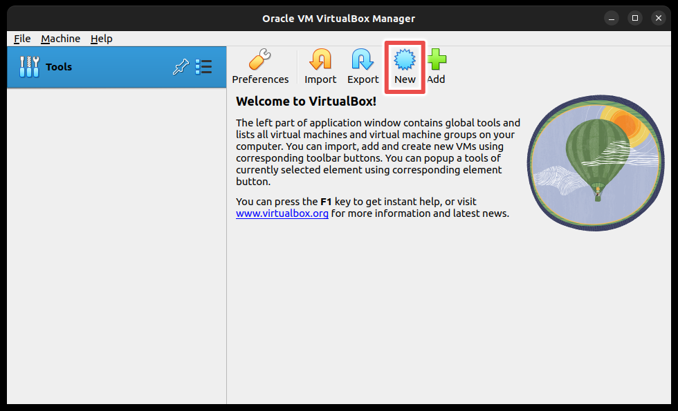

# VM setup for SIE
cuz it never works

## Download Ubuntu image file
Download latest stable version (LTS) on : https://ubuntu.com/download/desktop  
You should now have a `ubuntu-<version>-desktop-amd64.iso` file.

## VM Setup
In VirtualBox, click on "New".  


Enter a name and select the `.iso` file, then check the "Skip Unattended Installation" box.  
.png)

> **Warning**
> BE SURE TO CHECK THE "Skip Unattended Installation" BOX. IF IT IS NOT CHECKED, YOU WILL NEED TO ERASE AND RECREATE A NEW VIRTUAL MACHINE

**Click on "Next".**

Set the "Base Memory" to 4096 MB if possible (2048 MB if not).  
Set the "Processors" to 2 if possible (1 if not).

**Click on "Next".**

Keep Disk Size at 20 GB minimum.  
.png)

**Click on "Next" and finally "Finish".**

## Inside the VM
Select "Try or Install Ubuntu"  


Select "Install Ubuntu"  
.png)

Click on "Continue" and "Install now" until you can create a user.

Create a user and click on "Continue". (Keep the password simple)

After the system installation, click on "Restart Now".

When the following screen appears, just press <kbd>Enter</kbd>  


> **Note**
> It is recommanded to open the rest of this tutorial in the VM Browser

Open a terminal with <kbd>Ctrl</kbd> + <kbd>Alt</kbd> + <kbd>T</kbd>

Then type
```
sudo apt update && sudo apt upgrade
```

### Odoo

Open the VM menu and go to "Machine" > "Take a Snapshot".  
If something goes wrong you can reload this Snapshot.

Download odoo's installation script with
```
sudo wget https://raw.githubusercontent.com/Yenthe666/InstallScript/16.0/odoo_install.sh
```

Then type
```
sudo nano odoo_install.sh
```

Make sure that  
`INSTALL_WKHTMLOPDF` is set to `"True"`  
`GENERATE_RANDOM_PASSWORD` is set to `"False"`  
.png)

Save with <kbd>Ctrl</kbd> + <kbd>O</kbd> and <kbd>Ctrl</kbd> + <kbd>X</kbd>

In the terminal, type
```
sudo chmod +x odoo_install.sh
```
and
```
./odoo_install.sh
```

Press <kbd>Enter</kbd> when asked until the script ends.

**Odoo is now installed**

You can change the admin passoword by typing
```
sudo nano /etc/odoo-server.conf
```

Edit the `admin_passwd` variable

Restart the service
```
sudo service odoo-server restart
```

When you restart your VM, if odoo is not running, you can rerun the last command with `start` in place of `restart`, you can also stop it with `stop`.

You can now access Odoo via `localhost:8069` in your browser.

### Bonita

> **Warning**
> Do not submit your real informations to download

Download latest version on : https://www.bonitasoft.com/downloads  
You should have a `BonitaStudioCommunity-<version>-x86_64.run` file

Go in your download folder and type
```
chmod +x BonitaStudioCommunity-<version>-x86_64.run
```
and
```
./BonitaStudioCommunity-<version>-x86_64.run
```

Follow the UI Wizard instructions.

**Bonita is now installed**


## Troubleshooting

### Bonita's icon can't run

If the Bonita icon on your desktop cannot be run.  


Right click on it and select "Allow Lauching".  
.png)

It should now look like this and can now be run.  
